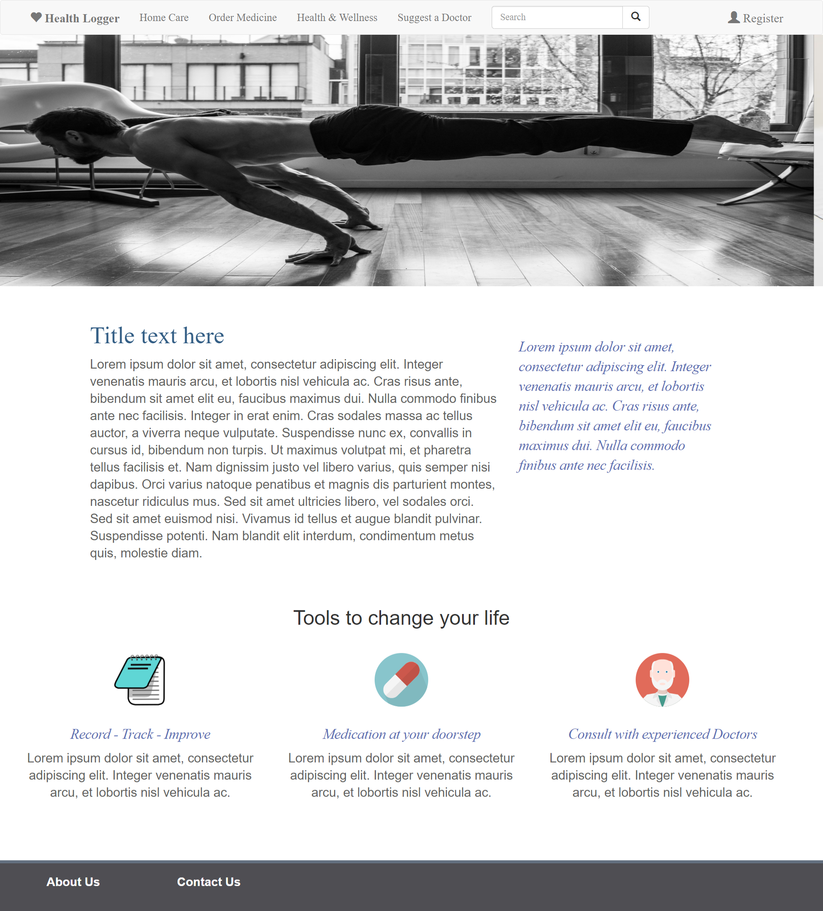
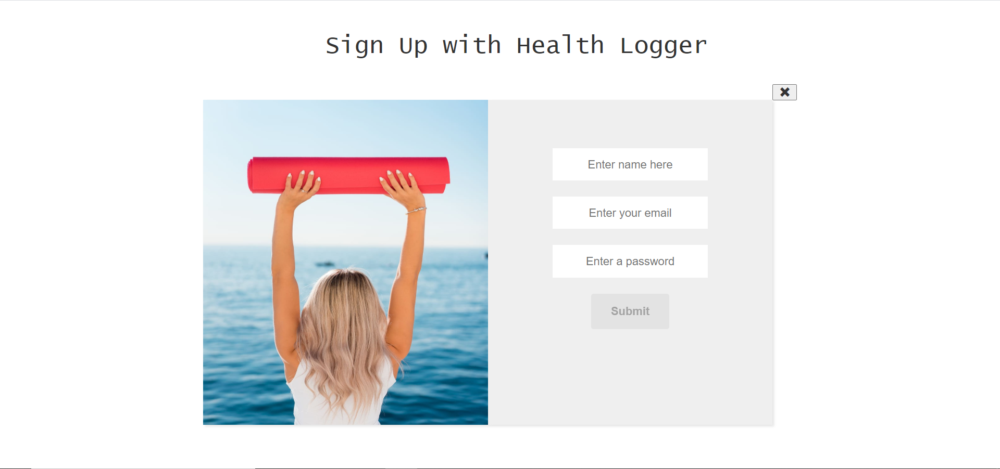
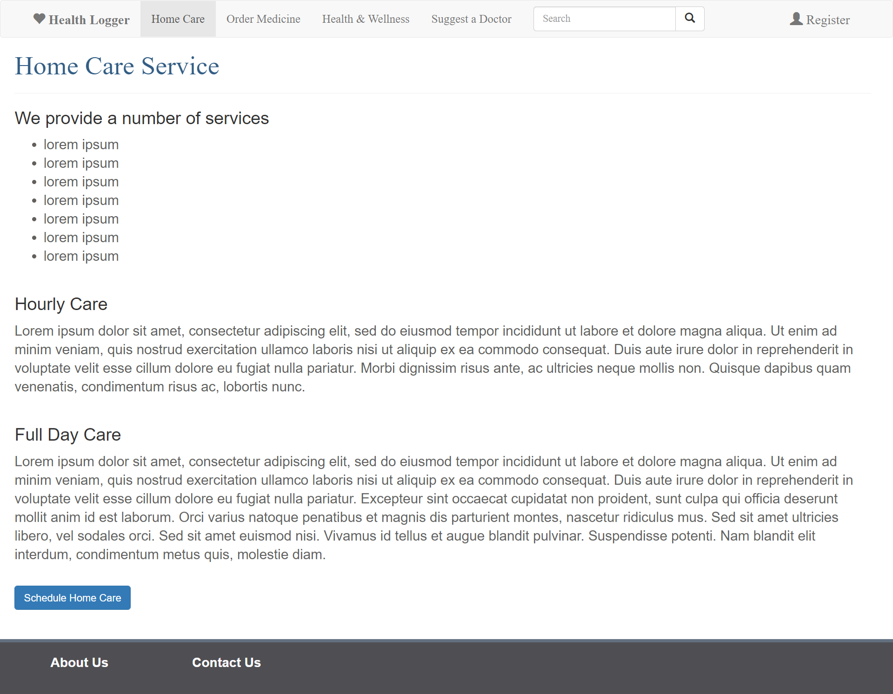
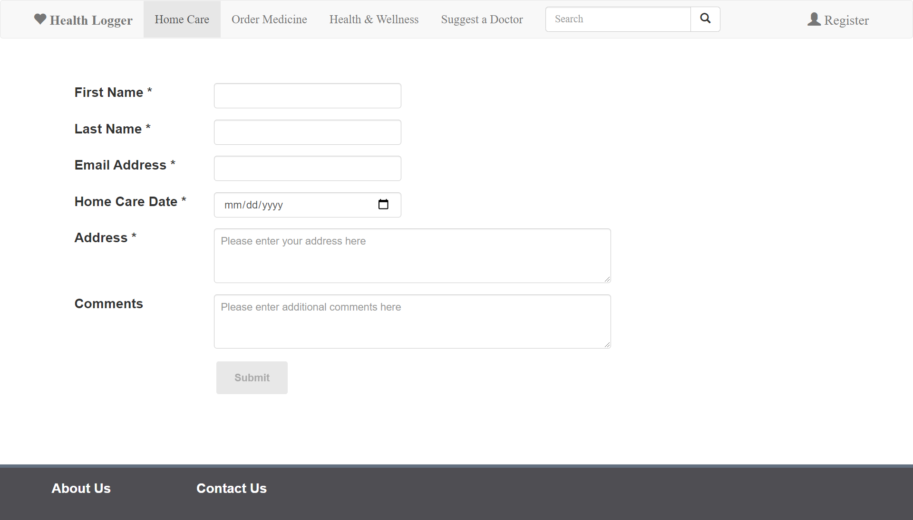
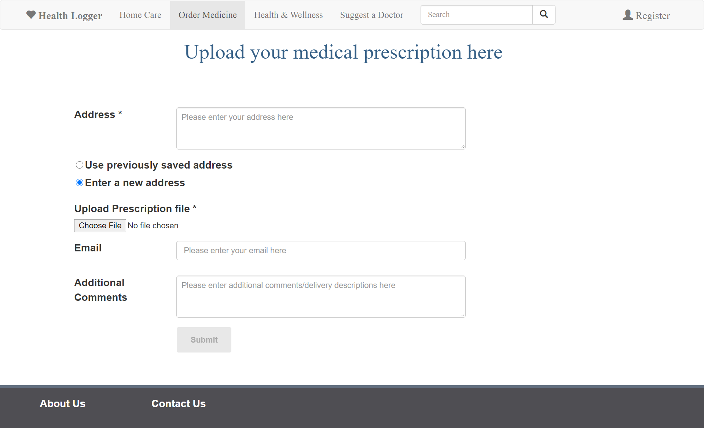

# Project Overview

This web application is the Front-End implementation of HealthLogger web application. The user can register, order medicine, 
view services, know how to contact us, know more about us and schedule home care.

* Date Created: 14 06 2020
* Last Modification Date: 03 09 2020

## Authors

* Harshit Trivedi(harshit.trivedi@dal.ca)

### Prerequisites

To have a local copy of this assignment and running on your local machine, you will first need to install the following:

npm i node -g [node]
npm install -g @angular/cli [The Angular CLI]

### Installing

Below is the step by step guide to get a development env running

In a new directory, clone the Git repository https://github.com/ht3886/HealthLogger_Angular.git

Open this project directory in your preferred IDE.

From the terminal window, run the command "npm install". This command will download and install all the necessary packages to 
run this Angular web application. Upon successful installation, the terminal will output with the message showing that 
a number of packages were added and audited.

From the terminal window, run the command "ng serve". 
If the code compiled successfully, the terminal will output with the message "Angular Live Development Server is listening on 
localhost:4200, open your browser on http://localhost:4200/"

Open your preferred browser. In the address bar, type "http://localhost:4200/" and hit enter.

In the address bar, type "localhost:4200" and hit enter.
You will be redirected to HealthLogger Home Page.

## Deployment

Heroku deployment link: https://health-logger-web-asgmt2.herokuapp.com/

## Web-Application Walkthrough and Links

Once the user visits the website, the first page that opens is the landing page. From here, the user can either register, 
or navigate to Home Care, Order Medicine, About Us or Contact Us page.

Landing page link - https://health-logger-web-asgmt2.herokuapp.com/
Registration page link - https://health-logger-web-asgmt2.herokuapp.com/register
Home Care Service page link - https://health-logger-web-asgmt2.herokuapp.com/homeCare
Book Home Care page link - https://health-logger-web-asgmt2.herokuapp.com/homeCare/bookHomeCare
Order Medicine page link - https://health-logger-web-asgmt2.herokuapp.com/orderMedicine
About Us page link - https://health-logger-web-asgmt2.herokuapp.com/aboutUs
Contact Us page link - https://health-logger-web-asgmt2.herokuapp.com/contactUs

## Screenshots

* Home page


* Registeration page


* Home Care Service page


* Book Home Care page


* Order Medicine page


## Built With

* [Angular CLI 9.1.3](https://cli.angular.io/) - The Angular CLI is a command-line interface tool that you use to initialize, 
develop, scaffold, and maintain Angular applications.
* [Bootstrap 3.4.1] (https://getbootstrap.com/docs/3.4/) - CSS framework used.

## Sources Used

### File Name - polyfills.ts

Lines 26, 34
---------------

```
import 'classlist.js';  // Run `npm install --save classlist.js`.
import 'web-animations-js';  // Run `npm install --save web-animations-js`.

```

The code above was created by adapting the code in(https://dev.to/getamano/angular-8-x-9-x-internet-explorer-not-working-quick-solution-3ha7) as shown below: 

```
// import 'classlist.js';  // Run `npm install --save classlist.js`.
// import 'web-animations-js'; // Run `npm install --save web-animations-js`.

```

- <!---How---> The code in (https://dev.to/getamano/angular-8-x-9-x-internet-explorer-not-working-quick-solution-3ha7) was implemented by Aman.
- <!---Why---> Aman's(https://dev.to/getamano/angular-8-x-9-x-internet-explorer-not-working-quick-solution-3ha7)'s code was used 
as a solution to support Angular on Internet Explorer.

### File Name - register.component.css

Lines 82-104
---------------

```
@media screen and (max-width: 750px) {
  .column {
    flex: 55%;
    margin: none;
  }
  .form-div{
    float: none;
  }
  .img-class{
    float: none;
  }
}
@media screen and (max-width: 600px) {
  .row {
    flex-direction: column;
    margin: none;
  }
  .form-div{
    float: none;
  }
  .img-class{
    float: none;
  }
```

The code above was created by adapting the code in(https://www.w3schools.com/css/tryit.asp?filename=trycss_mediaqueries_flex) as shown below: 

```
/* On screens that are 992px wide or less, go from four columns to two columns */
@media screen and (max-width: 992px) {
  .column {
    flex: 50%;
  }
}

/* On screens that are 600px wide or less, make the columns stack on top of each other instead of next to each other */
@media screen and (max-width: 600px) {
  .row {
    flex-direction: column;
  }
}
```

- <!---How---> The code is referenced from w3schools website (https://www.w3schools.com/css/tryit.asp?filename=trycss_mediaqueries_flex)
- <!---Why---> w3schools (https://www.w3schools.com/css/tryit.asp?filename=trycss_mediaqueries_flex)'s Code was used to implement the logic 
for making the registration page responsive. Moreover, the logic was referenced and the block of code is not copied as a whole.

## Libraries Used

* [ngx-slick-carousel 0.5.1] (https://www.npmjs.com/package/ngx-slick-carousel) - Used in the landing page (filename - landing-page.component.html) 
to create a carousel of images.

## Design Choices

* Use of Bootstrap CSS framework - I have used Bootstrap because it supports most browsers, is lightweight and responsive.
* Use of ngx carousel library - I have used this carousel library since carousels effectively inform the user about the web application's 
features on the home page itself.
* Use of white background - White background is easy to read on and is very natural. Dark text on white background enhances readability. 
The color-scheme of registration-form (white-smoke), navigation bar (grimmy's grey), footer (gun powder) and all carousel images 
are selected in a way that they are in contrast with the background color (white).
* All the design elements are consistent throughout the web application. All the headings, sub-headings, paragraph text, footer options, 
form-elements and buttons follow the same layout and format. The position and colors of all the elements are consistent and are designed 
in a way to create a typographic design.
* All the forms provide front-end validation and provide user feedback with proper error recovery messages.
* The web application implements a responsive layout and is cross browser compliant. 

## Acknowledgments

* The Lorem Ipsum (dummy text) was referenced from https://www.lipsum.com/feed/html
The dummy text is used in multiple pages, namely about-us.component.html, home-support.component.html and landing-page.component.html
* Registration page image referenced from - https://p0.piqsels.com/preview/197/436/58/active-blonde-body-cardio.jpg
* Landing page carousel image 1 referenced from - https://upload.wikimedia.org/wikipedia/commons/b/ba/Planche.jpg
* Landing page Carousel image 2 referenced from - https://cdn.pixabay.com/photo/2014/12/10/20/56/medical-563427_960_720.jpg
* Landing page Carousel image 3 referenced from - https://live.staticflickr.com/8067/29609195382_ebd40cdb3a_b.jpg
* Landing page notepad image referenced from - https://upload.wikimedia.org/wikipedia/commons/thumb/f/f0/Icon-notepad.svg/256px-Icon-notepad.svg.png
* Landing page medicine image referenced from - https://upload.wikimedia.org/wikipedia/commons/a/ab/Creative-Tail-medicine.svg
* Landing page doctor image referenced from - https://upload.wikimedia.org/wikipedia/commons/f/f8/Creative-Tail-People-doctor.svg
